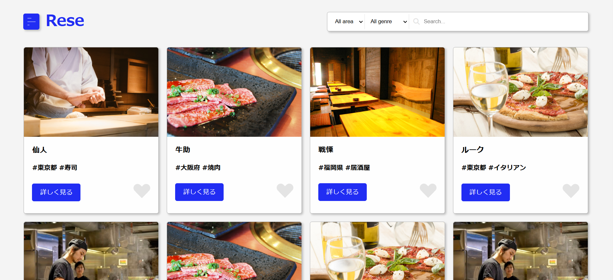

# 飲食店予約アプリ　Rese
概要説明：未ログイン状態で店舗情報とレビューを見ることができます。  
ログインすると飲食店の予約、お気に入り登録、来店後にレビューの投稿ができるようになります。  
予約当日の朝8時にリマインドメールが届きます。  
マイページの予約欄から予約内容の変更、削除ができ、「QRコードを表示する」ボタンを押すとQRコードが作成されます。  
店舗入口で店員さんに読み取ってもらうと予約内容を確認してもらえ、「確認しました」ボタンを押すことで予約データが”来店”に更新されます。  
決済機能はStripeを使用しています。  
また、ユーザー、管理者、店舗代表者の３つの権限を用意しました。


  

## 作成した目的
外部の飲食店予約サービスは手数料を取られるので、自社で予約サービスを持つため。
  
## アプリケーションのURL
<br>  

## 機能一覧
＊ユーザー＊　会員登録、ログイン/ログアウト、お気に入り追加/削除、予約の追加/変更/削除、レビュー機能、  
    店舗検索（ジャンル/エリア/店舗名の部分一致）、リマインドメール送信、QRコードで予約確認/来店に更新、決済機能（Stripe）

＊管理者＊　店舗代表者作成/更新/削除、代表者検索、お知らせメール送信

＊店舗代表者＊　店舗情報作成/更新/削除、予約確認


## 使用技術
docker、Laravel Framework 8.X、PHP 8.X、nginx 1.X、mysql 8.X、myadmin 5.X、mailhog、  
larevel-fortify、laravel-permission、Stripe、Javascript


## テーブル設計


## ER図


# 環境構築
<dl>
<dt>1.リポジトリの設定</dt>
<dd>開発環境をGitHubからクローン。</dd>

<dd>クローンを作りたいディレクトリ下で以下のコマンドを実行。</dd>

`$ git clone git@github.com:kozuka-yuko/Rese.git`

<dd>リポジトリ名の変更。</dd>

`$ mv Rese 新しいリポジトリ名`

<dt>2.個人のリモートリポジトリURLを変更</dt>
<dd>GitHubで、上記コマンドで指定した「新しいリポジトリ名」で変更先のリモートリポジトリをpublicで作成。</dd>

<dd>ローカルリポジトリから紐づけ先を変更するために、GitHubで新しいリポジトリ名で作成したリポジトリのURLを取得する。</dd>

<dd>URLはQuik setup～内の四角が二つ重なったアイコンから取得する。</dd>

<dd>開発のために新規作成したディレクトリに移動し、下記コマンドの実行。</dd>  

  ```
  $ git remote set-url origin 作成したリポジトリのURL
  $ git remote -v
  ```

<dd>2つ目のコマンドを実行した時に変更先のURLが表示されれば成功。</dd>

<dt>3.現在のローカルリポジトリのデータをリモートリポジトリに反映させる</dt>

  <dd>下記コマンドの実行。</dd>
  
  ```
  $ git add .
  $ git commit -m "リモートリポジトリの変更"
  $ git push origin main
  ```

  <dd>GitHubのページを見てdockerフォルダやsrcフォルダが反映されていれば成功。</dd>

  <dd>エラーが発生する場合は</dd>

  `$ sudo chmod -R 777 *`

  <dd>コマンドを実行後、もう一度コマンドを実行し直してみる。</dd>

<dt>4.Dockerの設定</dt>
  <dd>下記コマンドの実行。</dd>
  
  ```
  $ docker-compose up -d --build
  $ code .
  ```

  <dd>Dockerにコンテナができているか確認。</dd>

<dt>5.laravelのパッケージのインストール</dt>
<dd>共有元が作成したcomposer.jsonファイルやcomposer.lockファイルを元に必要なパッケージをインストールする。</dd>

<dd>PHPコンテナ内にログインする </dd>  

  `$ docker-compose exec php bash`

<dd>下記コマンドでcomposer.jsonに記載されたパッケージのリストをインストール。</dd>

  `$ composer install`

<dt>6.「.envファイル」の作成</dt>
  <dd>データベースに接続するために .envファイルを作成。PHPコンテナ内で以下のコマンドを実行。</dd> 
  
  ```
  $ cp .env.example .env
  $ exit
  ```
  
  <dd>作成できたらVSCodeから .envファイルの11行目以降を以下のように修正。</dd>
  
  ```
  // 前略

  DB_CONNECTION=mysql
  - DB_HOST=127.0.0.1
  + DB_HOST=mysql
  DB_PORT=3306
  - DB_DATABASE=laravel
  - DB_USERNAME=root
  - DB_PASSWORD=
  + DB_DATABASE=laravel_db
  + DB_USERNAME=laravel_user
  + DB_PASSWORD=laravel_pass

  // 後略
  ```

<dd>上記はdocker-compose.ymlで作成したデータベース名、ユーザー名、パスワードを記述している。</dd>
<dd>（mysqlのenvironent部分）</dd>
<dd>docker-compose.ymlで設定したphpmyadminにデータベース（laravel_db）が存在しているか確認。</dd>
<dd>http://localhost:8080/ で確認。</dd>

<dt>7.アプリケーションを実行できるようにキーを作成する</dt>  

  `$ php artisan key:generate`

<dd>データベースにダミーデータが存在するので以下のコマンドを実行することで表示される。</dd>

  <dd>PHPコンテナ内 </dd>  
  
  ```
  $ php artisan migrate
  $ php artisan db:seed
  ```

</dl>

## 画像をstrageに保存し、シンボリックを貼る
<dd>店舗画像をstrage配下に保存するようにしているためシンボリックリンクを貼ってください。</dd>
<dd>PHPコンテナ内で、下記コマンドを実行してください。</dd>

`$ php artisan storage:link`

## メール認証 
  .envファイルの MAIL_FORM_ADRESS= をnullではなく任意のメールアドレスにしてください。  
  
<dd>MAIL_MAILER=smtp</dd>
<dd>//メールの送信方法を指定</dd>　　
<dd>MAIL_HOST=smtp.example.com</dd>
<dd>//使用するSMTPサーバのホスト名</dd>　　
<dd>MAIL_PORT=587</dd>
<dd>//使用するポート番号</dd>
<dd>587:TLS（STARTTLS）ポート</dd>                         
<dd>465:SSLポート(暗号化が必要な場合)</dd>　　                            
<dd>MAIL_USERNAME=your_email@example.com</dd>
<dd>//メール送信用のアカウント名。通常はメールアドレスです。</dd>　　　　  
<dd>MAIL_PASSWORD=your_email_password</dd>
<dd>//メールアカウントのパスワードです。セキュリティのため、実際のパスワードではなく、専用のアプリケーションパスワードや API トークンを使用することが推奨されます。</dd>　　                                      
<dd>MAIL_ENCRYPTION=tls</dd>
<dd>//メール送信時の暗号化方法です。tls（推奨）や ssl を使用します。</dd>　　  
<dd>MAIL_FROM_ADDRESS=no-reply@example.com</dd>
<dd>//メール送信者のメールアドレスです。</dd>　　
<dd>MAIL_FROM_NAME="${APP_NAME}"</dd>
<dd>//メール送信者の名前です。"${APP_NAME}" でアプリケーション名を動的に取得できます。</dd>   


<dl>                                                               
<dt>＜MailHogについて＞</dt>
<dd>MailHogでメール送信を試す場合は現在の.envファイルで（一度本番環境である env.productionに切り替えている場合は、開発環境である env.development に切り替えて試してください。） localhost:8025 でブラウザを開き動作確認を行ってください。</dd>　　


<dt>＜Stripe決済の本番環境への移行＞</dt>  
<dd>1.Stripe決済を使用するためにStripeのホームページにアクセスしアカウントの作成・登録を行ってください。</dd>  
<dd>Stripeのダッシュボードから「アカウントの有効化」を行い、ビジネス情報や銀行口座を登録してください。</dd>　　

<dd>2.審査完了後に本番用の公開鍵と秘密鍵が発行されます。</dd>
<dd>Stripeのダッシュボードにpublishable key と secret key が表示されます。</dd>
<dd>env.productionファイルを開き、STRIPE_SECRET_KEY と STRIPE_PUBLIC_KEY それぞれに記述してください。</dd>
<dd>sk_live_ や pk_live_ から始まるキーです。</dd>

<dd>3.本番環境に公開後、実際に本物のカード情報を使って少額決済を行い、正常に動作するか確認してください。</dd>
<dd></dd>
<dd></dd>　　


<dt>＜環境の切り替え＞</dt>
<dd>※ 本番環境への切り替えは env.productionファイルへの必要事項の記述を終えてから行ってください。</dd>
<dd>※ permissionエラー（権限エラー）が出た場合は権限を与えてください。</dd>

`$ chmod 600 .env`

<dd>本番環境</dd>

```
$ rm .env
$ cp env.production .env
```

<dd>開発環境に戻す</dd>

```
$ rm .env
$ cp env.development .env
```

</dl>　　


<dl>
  <dt>＜キューの実行＞</dt>
　  <dd>大量のデータ処理やメール送信など時間のかかる重たい処理をバックグラウンドで非同期で行うために以下のコマンドを実行してください。</dd>  
 
   <dd>PHPコンテナ内</dd>
   
   `$ php artisan queue:work`  
  
  <dd>（停止はCtrl+C）</dd>　　


 <dt>＜スケジューラー実行＞</dt>  
 <dd>リマインドメールを送信できるようにするために実行してください。</dd>  

<dd>PHPコンテナ内（キューを実行しているので同じターミナル内でコマンドを打てないため新しいターミナルを開いて実行してください)</dd>
    
`$ php artisan schedule:work`  
    
<dd>(停止はCtrl+C)</dd>


</dl>   

   ## アカウントの種類  
   1.管理者　　　　email: admin@sample.com  
   2.店舗代表者　　email: shop_rep@sample.com  
   3.ユーザー　　　email: gest@sample.com  
   
   ※パスワードは全て”password”でログインできます。
   <dd>現在上記3つのダミーデータが用意してあります。</dd>
   
